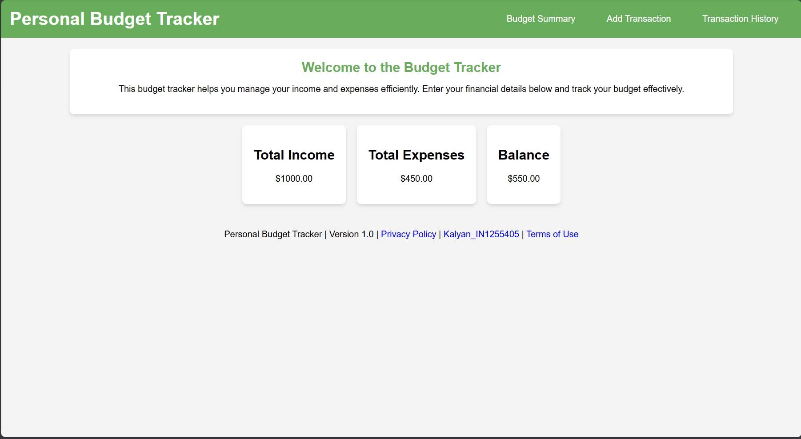
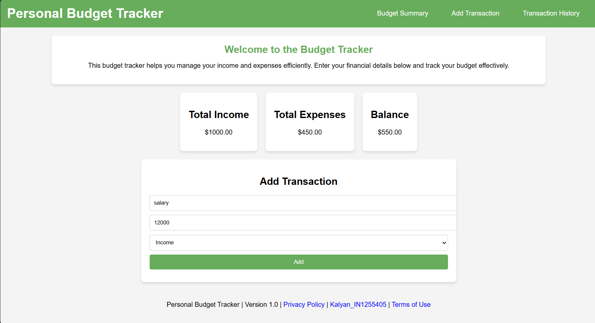
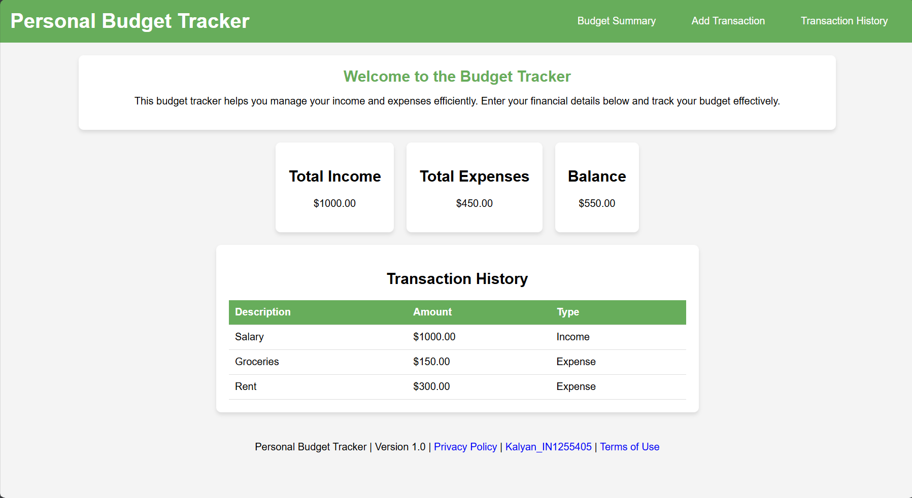

# **Personal Budget Tracker Web Application**

This is a simple and interactive **Personal Budget Tracker** web application that allows users to track their income, expenses, and balance efficiently. The application features a user-friendly interface, dynamic transaction management, and provides real-time budget insights.

---

## **Features**
- **Budget Summary:** View total income, expenses, and remaining balance at a glance.
- **Add Transaction:** Easily add income or expense transactions with descriptions.
- **Transaction History:** View the list of transactions with categorized types.
- **Interactive Navigation:** Navigate seamlessly between sections.
- **Data Persistence:** Simple session-based handling for budget data.

---

## **Getting Started**

### **1. Clone the Repository**
```bash
git clone https://github.com/kalyan-3214/Budget-Tracker-In-1255405-Assign-1.git
cd budget-tracker
```

### **2. Open the Application**
Open the `index.html` file in your browser.

---

## **Usage Guide**

### **1. Budget Summary Section**
View your current **Total Income**, **Total Expenses**, and **Balance**:


---

### **2. Adding a Transaction**
Navigate to the **Add Transaction** section to log a new income or expense:
1. Enter the transaction **description**.
2. Enter the **amount**.
3. Select **Income** or **Expense**.
4. Click the **Add** button.


---

### **3. Transaction History**
Navigate to the **Transaction History** section to view past transactions:


---

## **Application Flow**

1. **Home Page:** Introduction to the app and brief instructions.
2. **Budget Summary:** Real-time financial insights.
3. **Add Transaction:** Quick data entry for expenses and income.
4. **Transaction List:** Comprehensive history of financial activity.

---

## **Technologies Used**
- **HTML5**: Structure of the application  
- **CSS3**: Styling for layout and design  
- **JavaScript**: Dynamic interactivity and data manipulation  

---

## **Enhancements (Future Improvements)**
- Persistent data storage using LocalStorage or backend integration.
- Enhanced security and validation for inputs.
- Advanced visualization charts for budget trends.

---

---

## **Contact**
Developed by [Kalyan Akula](mailto:kalyan3214akula@gmail.com)  
Version: 1.0  
License: MIT

